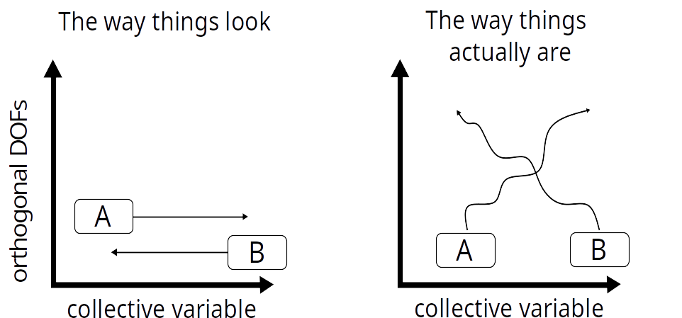
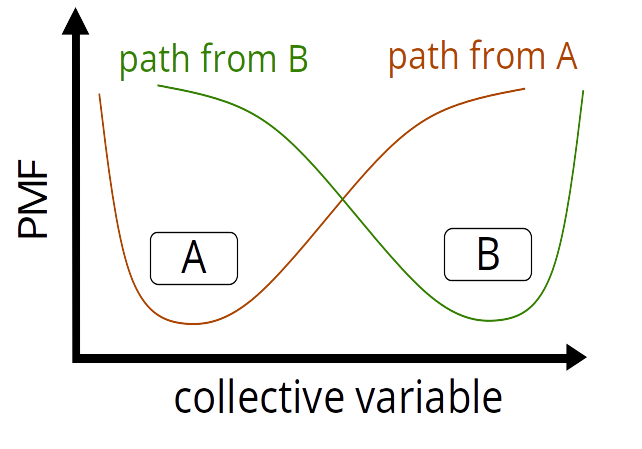
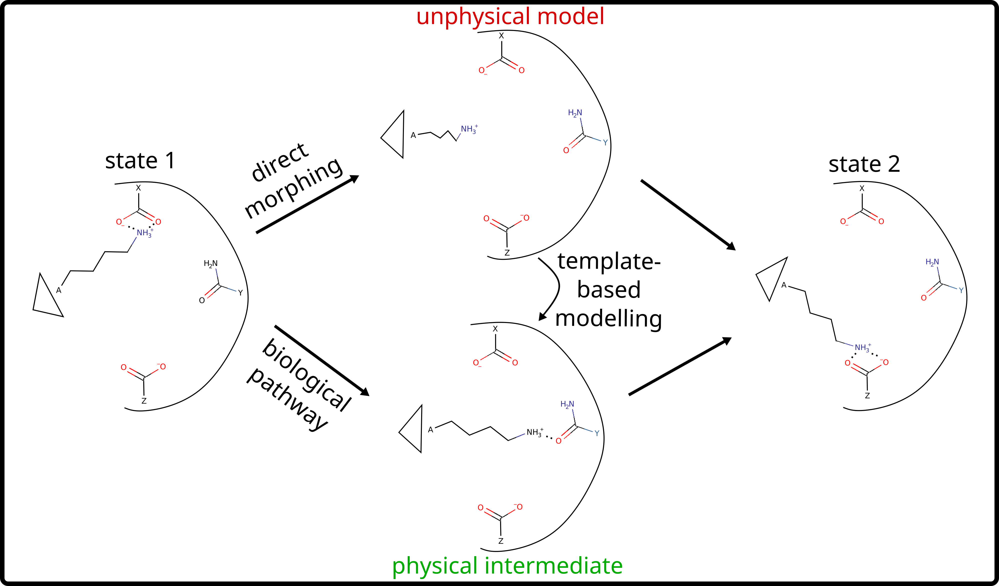

Background on MEMENTO
=====================

A scientific publication describing this method in detail and with proper references is in preparation, please read and cite this when it is released.

In short, MEMENTO seeks to address a common problem of computing free energy landscapes of protein conformational changes: starting state dependence (or hysteresis).
Importance sampling techniques such as umbrella sampling can be used to generate potential of mean force (PMF) profiles of any molecular process,
as long as it can be described along a number of reaction coordinates, or collective variable (usually one or two). The success of this approach depends on appropriate starting
structures for each of the stratified windows and on the proper equilibration
of all degrees of freedom that are orthogonal to the chosen reaction coordinate(s).

This can pose a two-fold problem for the investigator if orthogonal degrees of freedom are slow.
When using standard techniques such as targeted MD (tMD) or metadynamics along a collective variable to move between
two known states, it may seem as though a path between the two states is found where in reality one reaches
only metastable, unphysical states. These may project to the same value of the collective variable, but usually
do not have solvent and side-chain interaction networks equilibrated along the path.

In subsequent umbrella sampling, if the orthogonal degrees of freedom relax slower than the sampling time per window (as is common for complex conformational changes),
the result may look converged, but there will be a strong dependence of the observed free energy surface on the
history of the simulation boxes along the path. In the example of tMD with umbrella sampling, the direction of the tMD matters
in that usually the starting state of the tMD run in question appears to be favoured in the PMF.

There are two principle ways in which this issue can be addressed:

#. Better collective variables may give closer-to-equilibrium paths and equilibration on the timescale of umbrella windows
#. History-independent path generation can improve umbrella sampling outcomes by starting closer to an equilibrium path.

Because collective variable design is inherently difficult concerning systems for which there is not already extensive sampling or physical knowledge, MEMENTO focuses on the second solution
(although in our publication we show how collective variables can be iteratively improved starting from MEMENTO paths
as well). The workflow is detailed below.

#. Two known endstates are connected by a path of directly interpolated intermediate coordinates. 
#. At each intermediate, an ensemble of models is constructed using template-based modelling, based on the unphysical morph.
#. The smoothest path through the space of these models is found using Monte-Carlo annealing.
#. The models are processed for MD simulations, solvated and -- if necessary -- embedded in lipids.
#. Solvent and side-chains are equilibrated with constrainted Cα coordinates.

From the resulting history-independent paths, umbrella sampling can construct the PMF of the system. If necessary, collective variables can be refined at this stage
(described in our paper, but not implemented in PyMEMENTO as this will be highly system-dependent and good tools already exist for instance for principal-component analysis).